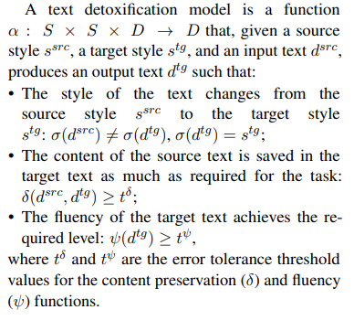

# Solution Building

## Problem exploration

### Problem definition
I checked the article that is given in the assignment description and get problem definition:

Thus, mainly, this is a seq2seq problem.

## Exploration of possible solutions
I started to search for different solutions for this problem. I found 3 possible variants:
* LSTM
* Transformer
* [Diffusion Models](https://aclanthology.org/2023.findings-acl.478.pdf).

## Solution choice
First, LSTM is a pretty good and reliable approach. [It is hard to conclude which model
between LSTMs and Transformer](https://www.researchgate.net/post/Comparing_LSTM_and_Transformer_Architectures_for_Natural_Language_Processing)
in terms of results quality.

Second, Transformer is also a reliable solution. In addition, Transformer are easier to train than LSTMs due to sequential data processing of the last ones.
Further, there are many pretrained solutions on different seq2seq tasks that can be tested

Third, Diffusion models are not very popular, despite their efficiency. Therefore, it would be much harder to set up a 
solution based on Diffusion Models. 

After weighing all the pros and cons, I decided to choose only one option for solution building - Transformers.

## Baseline: Custom Transformer
For basic solution I will use my own transformer.

Architecture is very basic, I am using the one that was introduced 
[in this article](https://arxiv.org/abs/1706.03762)

## Hypothesis 1: Pretrained embedding

## Hypothesis 2: Pretrained Transformer
