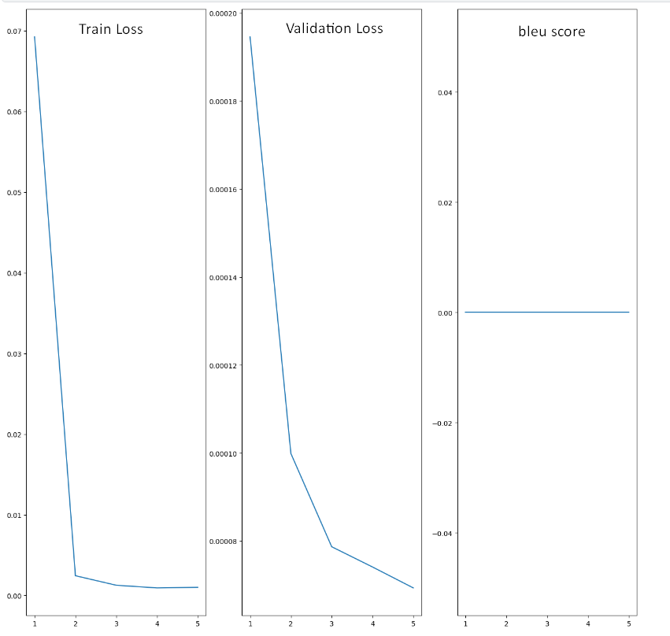

# Solution Building

## Problem exploration

### Problem definition
I checked the article that is given in the assignment description and get problem definition:

Thus, mainly, this is a seq2seq problem.

## Exploration of possible solutions
I started to search for different solutions for this problem. I found 3 possible variants:
* LSTM
* Transformer
* [Diffusion Models](https://aclanthology.org/2023.findings-acl.478.pdf).

## Solution choice
First, LSTM is a pretty good and reliable approach. [It is hard to conclude which model
between LSTMs and Transformer](https://www.researchgate.net/post/Comparing_LSTM_and_Transformer_Architectures_for_Natural_Language_Processing)
in terms of results quality.

Second, Transformer is also a reliable solution. In addition, Transformer are easier to train than LSTMs due to sequential data processing of the last ones.
Further, there are many pretrained solutions on different seq2seq tasks that can be tested

Third, Diffusion models are not very popular, despite their efficiency. Therefore, it would be much harder to set up a 
solution based on Diffusion Models. 

After weighing all the pros and cons, I decided to choose only one option for solution building - Transformers.

## Baseline: Custom Transformer
For basic solution I will use my own transformer.

Architecture is very basic, I am using the one that was introduced 
[in this article](https://arxiv.org/abs/1706.03762)

As reference for building such architecture, I took this [video](https://www.youtube.com/watch?v=M6adRGJe5cQ)
To produce a translation, I am sending to the model source and tensor with only one number - '<bos>' index

### Problems:
In the graphs below, we can see that loss is decreasing. Furthermore, after the first epoch validation loss is too small. 
In the other hand, translations that I get is highly poor: the return was just some token repeated many times. 
Therefore, I got 0 Bleu score for each epoch. Thus, we can conclude that there is a
problem of overfitting.

### Solving the issues:
Facing this problem I decided to consult with other people and tried to find a possible solution using chatGPT.
The proposals were the following:
* Fine tune hyperparameters
* Try to change batch_size

Unfortunately, I could not solve this issue. I tried around 15 samples of hyperparameters, but the only thing that changed -
token that was repeating.

Notebook for this hypothesis is **./notebooks/2_0_baseline_hypothesis**

### Decision
After spending around 20 hours on this transformer, I decided that I should pass this 'reliable' solution, and move on
to the next. 

Well my next hypothesis was - try to improve performance by using pretrained embedding. The initial performance 
was poor, and using pretrained embedding may not fix the cause of bad performance (overfitting). Therefore, in order to 
speed up solution exploration process, I decided to completely abandon **custom solutions**. Further, I will focus mostly
on existing solutions.

Let's try to fine-tune existing pretrained transformers on my filtered dataset

## Hypothesis 1: Fine-tuning pretrained Transformer on preprocessed dataset.

### Architecture building
In this section I was trying to fine-tune pretrained transformer on my preprocessed dataset. I took T5-small model.
Then I improved my **CustomDataset** from **baseline notebook** in order to train T5-small on it.

Whole process can be seen in **2_1_fine_tuned_transformer_T5.ipynb**
It was based on [this video](https://www.youtube.com/watch?v=T2fISIRogkg)

Fine-tuning is an expensive process in terms of computations. Therefore, I used only 1 epoch

Saved version of this model can be found in ../models
### Results

For evaluation of my model I used [blue score](https://en.wikipedia.org/wiki/BLEU) and [meteor score](https://en.wikipedia.org/wiki/METEOR)

In this metrics model gave pretty decent results:

#### There are some examples of detoxification:
* Source:  until i hear back, it'd be damn stupid to fix on any plan. there's only one plan.
* Prediction:   until i hear back, it would be silly to fix any plan.
* Translation:  it would be silly to plan something until i hear the report.
* Bleu score:  0.4359765514726485
* Meteor score:  0.7205058516833988

* Source:  you didn't tell me you live at the top of the fucking globe.
* Prediction:   you didn't tell me you lived on the top of the globe.
* Translation:  you didn't tell me you were on top of the planet.
* Bleu score:  0.5181294220614273
* Meteor score:  0.7904548844146162

* Source:  that poor man's dead......and i'm all bent because the paper used my stupid sophomore photo.
* Prediction:   the poor guy is dead...... and i'm all bent because the paper used my sopho
* Translation:  the poor man is dead, and i tipped them all off because the press used my old photos.
* Bleu score:  3.504102319683875e-78
* Meteor score:  0.5035577449370552

* Source:  spanky: i hope you know what the hell you're doin'.
* Prediction:   i hope you know what you're doing.
* Translation:  i hope you know what you're doing.
* Bleu score:  1.0
* Meteor score:  0.9996243425995492

* Source:  shit, they killed kenny!
* Prediction:   they killed kenny!
* Translation:  oh, my god. they've killed kenny.
* Bleu score:  0.17395797375642233
* Meteor score:  0.7014492753623189

* Source:  but if it's just gone, the fuck's he gonna say?
* Prediction:   but if it's gone, what's he gonna say?
* Translation:  but if it's just gone, what can he say?
* Bleu score:  0.42104389635861716
* Meteor score:  0.6836432797971259

* Source:  the fruition of my deeply-laid plans to escape from that cursed ovarian bastille.
* Prediction:   the fruition of my deeply-laid plans to escape from the cursed
* Translation:  the execution of my elaborate plans to escape from the accursed ovarian bastille.
* Bleu score:  0.20217803037339238
* Meteor score:  0.4476472701149425

* Source:  the pig is in the pool?! fuck.
* Prediction:   the pig's in the pool?
* Translation:  the pig is in the pool?
* Bleu score:  0.4412484512922977
* Meteor score:  0.7773446457234581

* Source:  what will kill me...
* Prediction:   what kills me...
* Translation:  "what does not kill me"...
* Bleu score:  1.4256605770826504e-231
* Meteor score:  0.28301886792452824

* Source:  michael, why are you speaking pig latin incorrectly?
* Prediction:   michael, why are you talking pig latin wrongly?
* Translation:  michael, why do you speak impromptu latin?
* Bleu score:  0.34315019159021515
* Meteor score:  0.6511472717006315

## Hypothesis 2: Already pretrained Transformer on ParaMNT-detox dataset

Results for previous hypothesis were quite reasonable. How can
I improve it? Using bigger model? Or maybe using more epochs
These are good proposals, but these approaches are time consumable.

Maybe I can skip all these computations. Maybe there are already existing solution pretrained on our dataset or 
on a similar one. So, why should I reinvent the wheel?

After spending some time searching, [this model](https://huggingface.co/s-nlp/t5-paranmt-detox) was found

Since this model is already pretrained on out dataset, for this solution we will only evaluate results obtained.
This evaluation can be found in **../notebooks/2_2_pretrained_transformer_T5.ipynb**

### Results
I used same metrics.

Model gave this results:

As expected there are improvements in both scores. However,
I thought that these improvements would be more significant,
and more visual. Nevertheless, this model generates more 
adequate detoxified sentences than the previous one. Below
there are some examples

#### Examples of detoxification
* Source:  you're just scared of killing a man today.
* Prediction:  You're just scared of killing a man today.
* Translation:  I think you're just freaking out because you killed a guy today.
* Bleu score:  3.5152852745683333e-78
* Meteor score:  0.688395061728395

* Source:  Damn near a hundred.
* Prediction:  a hundred.
* Translation:  hell, nearly all 100.
* Bleu score:  1.1640469867513693e-231
* Meteor score:  0.11904761904761905

* Source:  you give me Ryan Wheeler, the old Wheeler, the jerk, you give me that.
* Prediction:  You give me Ryan Wheeler, the old Wheeler, the snitch, you
* Translation:  You give me Ryan Wheeler, the old Wheeler, the savage, you give me that guy,
* Bleu score:  0.628450290578739
* Meteor score:  0.807115606423565

* Source:  This... this poor girl has every sexually transmitted disease you can get.
* Prediction:  this poor girl has every sexually transmitted disease you can get.
* Translation:  this poor thing... has all the communicable diseases you can get.
* Bleu score:  0.20333448190047881
* Meteor score:  0.5900804924242424

* Source:  our ignorance, that's what we're gonna lose.
* Prediction:  Our ignorance is what we lose.
* Translation:  Our innocence, that's what we've got to lose.
* Bleu score:  7.221948193667952e-155
* Meteor score:  0.5792207792207792

* Source:  oh, shit!
* Prediction:  Oh, hell!
* Translation:  Oh! Gosh.
* Bleu score:  1.384292958842266e-231
* Meteor score:  0.2380952380952381

* Source:  Please just go out the window. Shit.
* Prediction:  please go out the window.
* Translation:  please come out the window.
* Bleu score:  0.537284965911771
* Meteor score:  0.8066666666666668

* Source:  He kills himself. Deb can drink to his honor on her own.
* Prediction:  Deb can drink to his honor on her own.
* Translation:  Deb can toast herself in his honor.
* Bleu score:  7.551819280284158e-155
* Meteor score:  0.45510204081632655

* Source:  Remember, you're crazy for the taste of Fruzzi yogurt.
* Prediction:  remember, you're crazy about the taste of Fruzzi's yogurt.
* Translation:  remember, you're rooting for the taste of that Fruzzi yoghurt.
* Bleu score:  0.3014335251508215
* Meteor score:  0.6502890173410405

* Source:  I'm just looking through the fucking window!
* Prediction:  I'm just looking through the window!
* Translation:  I'm looking through the tucking window.
* Bleu score:  5.542933034426911e-78
* Meteor score:  0.7230634189159536